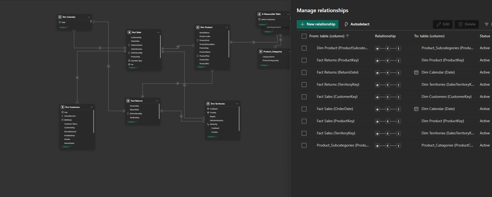
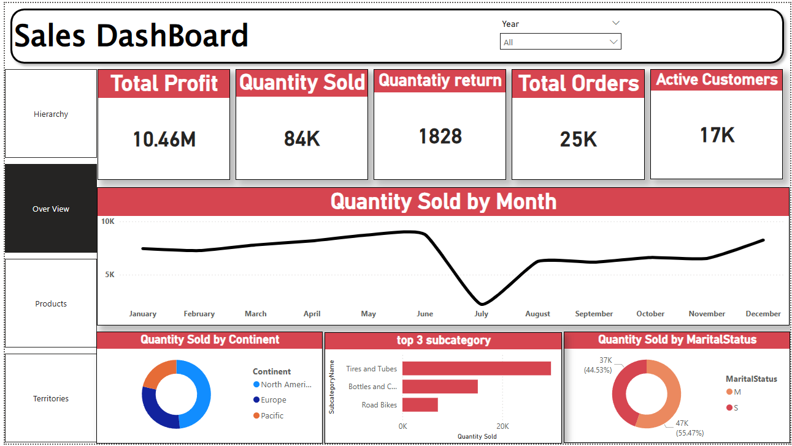
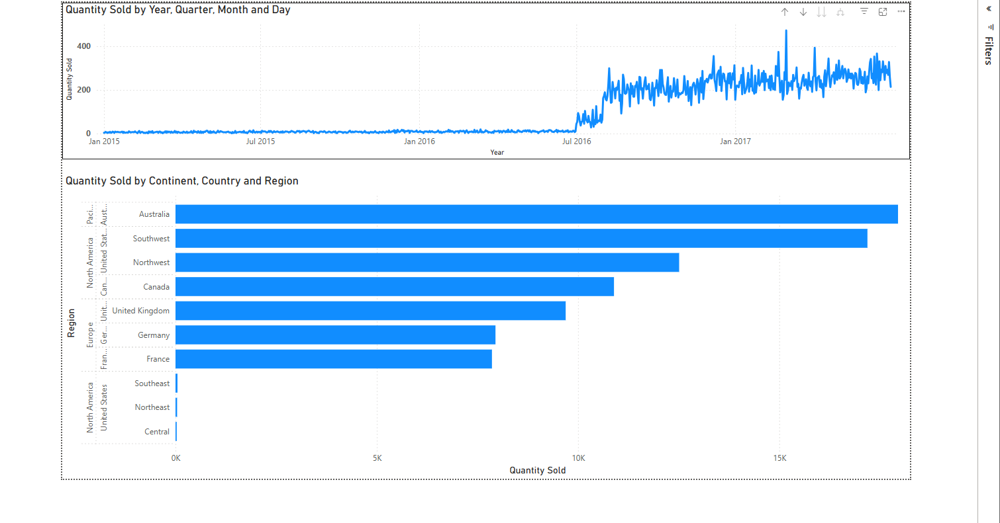
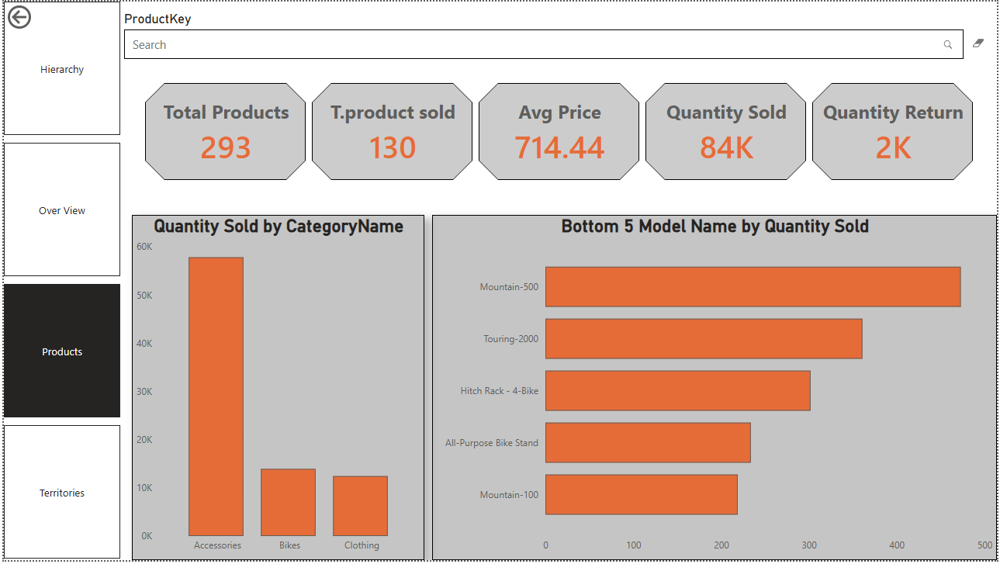
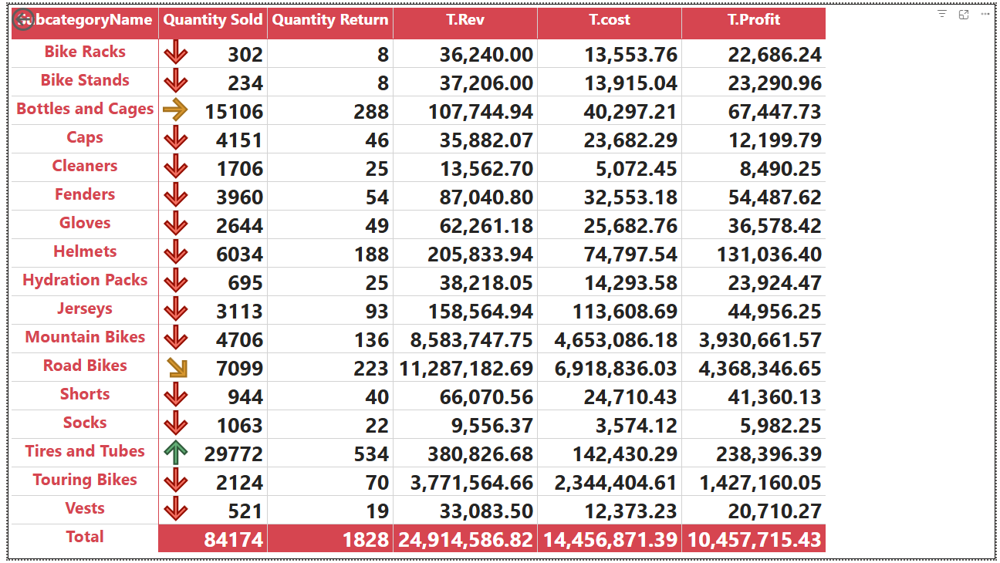
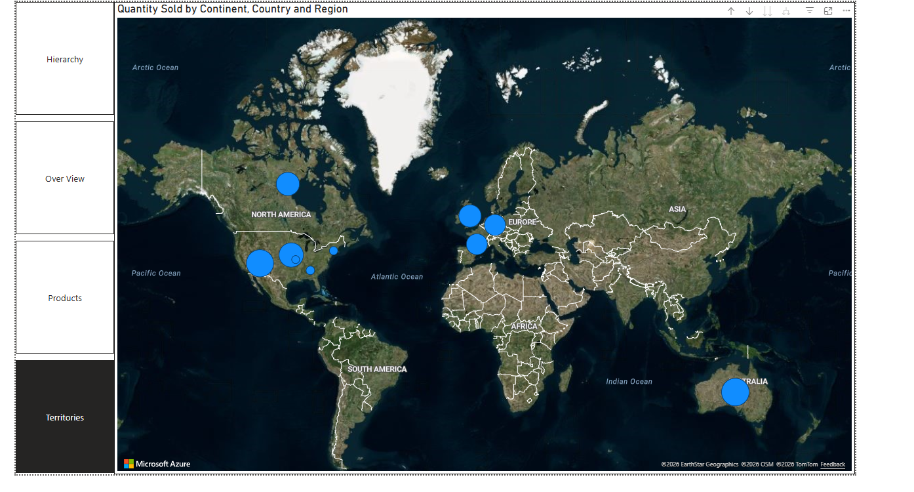

# 📊 Sales Performance Dashboard

## 📌 Overview
This project presents a comprehensive **Sales Performance Dashboard** built using Power BI to analyze business operations across products, customers, and geographical regions.

The project focuses on transforming raw sales data into meaningful insights through **data modeling, DAX calculations, and interactive visualizations**, enabling effective data-driven decision-making.

---

## 🧱 Data Modeling

A well-structured data model was designed using a **star schema approach**, including:

- Fact Tables:
  - Fact Sales  
  - Fact Returns  

- Dimension Tables:
  - Dim Customers  
  - Dim Products  
  - Dim Date  
  - Dim Territories  
  - Product Categories & Subcategories  

Relationships were carefully created to ensure accurate aggregation and filtering across all visuals.

---

## 🧹 Data Preparation
- Cleaned and transformed raw datasets using **Power Query**  
- Handled missing values and ensured data consistency  
- Standardized column formats and data types  
- Created calculated columns such as:
  - Year, Month, Quarter  
  - Product hierarchy  
- Optimized the dataset for efficient reporting  

---

## 📊 Dashboard Overview

---

## 📈 Time Analysis

- Quantity sold trends across:
  - Year  
  - Quarter  
  - Month  
  - Day  
- Identifies seasonality and performance fluctuations  

---

## 🛍️ Product Analysis

- Top 3 subcategories by quantity sold  
- Bottom-performing products  
- Sales distribution across product categories  
- Product-level performance insights  

---

## 📋 Sales Details

- Detailed breakdown of:
  - Revenue  
  - Cost  
  - Profit  
  - Quantity Sold & Returned  

---

## 🌍 Geographic Analysis

- Sales performance across:
  - Continent  
  - Country  
  - Region  
- Interactive map visualization showing global sales distribution  

---

## 📊 Key Insights
- Certain product categories (e.g., Accessories) dominate total sales volume  
- A small number of products contribute disproportionately to total revenue  
- Sales show clear trends over time, with noticeable fluctuations  
- Geographic regions vary significantly in performance  
- Some products have high return rates, impacting overall profitability  

---

## 🛠️ Tools & Technologies
- Power BI  
- Power Query  
- DAX (Data Analysis Expressions)  
- Data Modeling (Star Schema)  
- Data Visualization  

---

## 🚀 Outcome
This project demonstrates the ability to:
- Build a complete data model from scratch  
- Transform raw data into structured datasets  
- Create interactive dashboards  
- Extract meaningful business insights  
